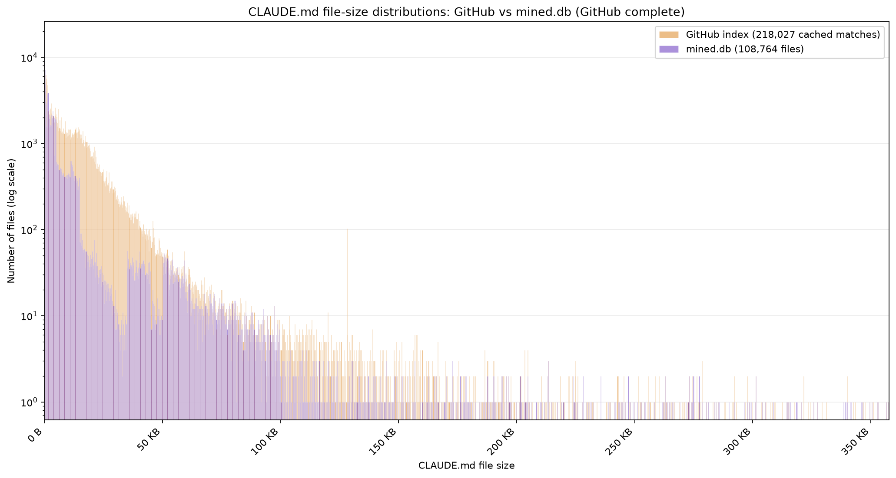
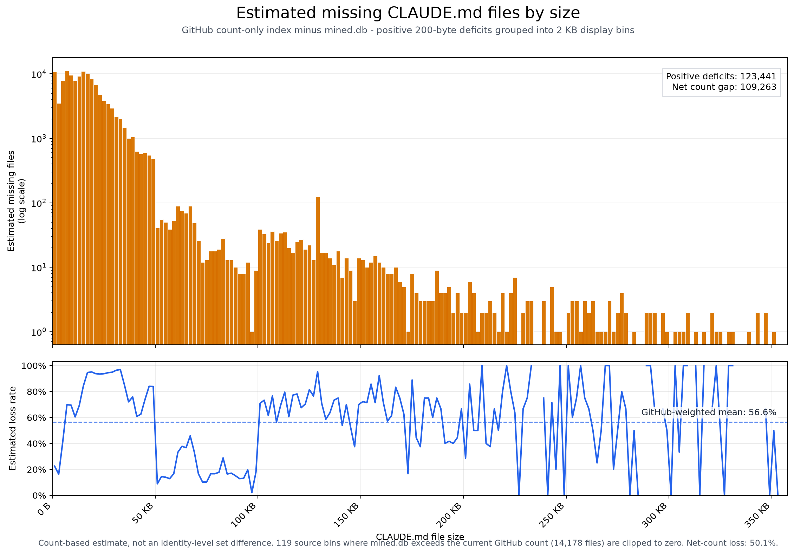

# Replication package for “Dear Claude, Read This First”

This repository contains the code and fixed inputs used for the paper:

> Juan de Lara and Esther Guerra. *Dear Claude, Read This First: A
> Large-scale Study of Repository-Level Instructions for AI Coding Agents.*

The package reproduces the reported dataset counts, repository description,
file-size results and figure, Markdown section and list analysis, natural and
fenced-language results, diagram counts, repository placement, references,
imports, repeated content, and `AGENTS.md` compatibility analysis.

The 1.20 GB SQLite database is distributed separately. It will be placed on
Zenodo; a private download can be used until that record is available. The
analysis scripts open the database read-only and write their results under
`results/`.

The manuscript sources, the `article.md` research notebook, and the programs
used to collect files from GitHub are deliberately not included.

## Repository contents

| Path | Contents |
|---|---|
| `scripts/` | One Python program for each analysis. |
| `miner/` | Shared Markdown, reference, import, and notation-analysis code. |
| `config/` | Notation and diagram-language definitions. |
| `inputs/` | Frozen GitHub counts and completed manual-review files. |
| `figures/` | Static dataset-coverage figures shown below. |
| `reference_results/` | Compact outputs from the paper run for comparison. |
| `data/` | Location for the separately downloaded `mined.db`. |
| `models/` | Location for the separately downloaded language model. |
| `results/` | Locally generated outputs; ignored by Git. |
| `tests/` | Unit tests for the parsers and analysis programs. |
| `LICENSE` | MIT License for the Python software. |
| `DATA_LICENSE.md` | Licenses and rights that apply to the database and research outputs. |

## What “exact CLAUDE.md” means

GitHub's `filename:CLAUDE.md` query returned names that merely contain the
query text, such as `CLAUDE.md.template`. The paper's main population keeps
only paths whose basename equals `CLAUDE.md`, ignoring letter case. Thus,
`CLAUDE.md`, `claude.md`, and `Claude.md` count, while
`CLAUDE.md.template` does not.

The distinction produces these populations:

| Population | Files | Repositories represented |
|---|---:|---:|
| All stored query matches | 115,779 | 96,235 |
| Exact basename, case-insensitive (paper population) | 108,764 | 92,238 |
| Exact basename and exact case `CLAUDE.md` | 103,537 | 88,189 |
| Query matches that are not an exact basename | 7,015 | 4,659 |

The repository count in each row counts repositories represented by that row;
the rows are not all mutually exclusive at repository level. For example, a
repository can contain both an exact name and a non-exact query match.

## How does the dataset compare with GitHub's search results?

We wanted to get a broad sense of how much of the material visible through
GitHub search is represented in our frozen dataset. To make this comparison,
we divided the file-size range into consecutive intervals of 200 bytes and
asked GitHub how many results it found in each interval. These count-only
queries were collected in July 2026. We then counted the files of the same
sizes in the frozen database.

Across all size intervals, GitHub reported 218,027 results. The database
contains 108,764 files whose basename is exactly `CLAUDE.md`, ignoring letter
case. The difference between these totals is 109,263 files, which is 50.11% of
the GitHub total. This does not mean that we can identify 109,263 particular
files that are missing. It simply means that the two sets of counts differ by
that amount.

The first figure shows where the two totals come from. Each narrow bar
represents a 200-byte file-size interval. The horizontal axis shows file size
and the vertical axis shows the number of results. The vertical axis uses a
logarithmic scale so that the much smaller counts for large files remain
visible. The two distributions have a broadly similar shape, but the database
count is lower in many of the intervals where most files occur.



The second figure looks directly at the difference between the two counts. For
each 200-byte size interval, we subtract the number of database files from the
GitHub count. If the database contains more files in an interval, we show the
difference as zero rather than as a negative value. For readability, the
figure combines ten adjacent intervals into 2 KB groups. The upper panel shows
the resulting count difference, while the lower panel expresses the same
difference as a percentage of the GitHub count.



Adding only these positive differences gives 123,441 files. The average
positive difference, weighted by the number of GitHub results in each
interval, is 56.62%. Weighting means that intervals containing many GitHub
results influence the average more than intervals containing only a handful.
These figures are larger than the simple difference between the two overall
totals. The reason is that the database count is actually higher than the
cached GitHub count in 119 intervals, by 14,178 files altogether. Those cases
reduce the overall difference, but they are set to zero in the
positive-difference calculation.

Most of the difference occurs among files of ordinary size rather than among
the very largest files. Half of the summed positive difference appears at or
below 14.4 KB. About 72.4% appears at or below 20 KB, 90.0% at or below 30 KB,
and 98.6% at or below 50 KB.

There are several reasons to interpret this comparison cautiously. The GitHub
queries returned counts, not the identities of individual files, so we cannot
match the results one by one. GitHub's index and the database were also
observed at different times, and repositories can change between observations.
In addition, GitHub's `filename:CLAUDE.md` search can include names such as
`CLAUDE.md.template`, whereas the database total used here includes only an
exact `CLAUDE.md` basename. GitHub did not mark any of the cached count
responses as incomplete, but these remaining differences still prevent us
from calculating exact recall—that is, the share of all relevant GitHub files
captured by the dataset. The figures provide a useful comparison between the
two study snapshots, not a measurement of GitHub's current contents.

## Requirements

The reported run used:

- Python 3.13.4;
- SQLite 3.49.1 through Python's `sqlite3` module;
- the package versions pinned in `requirements.txt`;
- the additional packages in `requirements-language.txt` only for the prose-
  language analysis.

Allow at least 5 GB of free disk space if running every analysis. The database
uses 1.20 GB, the language model uses 131 MB, the resumable language cache can
grow substantially, and the complete reference/import CSV files occupy
hundreds of megabytes.

Most analyses take seconds to a few minutes on a current workstation. The
prose-language analysis is the exception: it runs two classifiers over many
paragraphs and can take hours. Its separate cache allows an interrupted run to
resume.

## Quick start

Run all commands from the repository root. Commands below are written as
single lines so that they work in PowerShell, Command Prompt, bash, and zsh.

### 1. Create an isolated Python environment

```console
python -m venv .venv
```

Activate it on Linux or macOS:

```console
source .venv/bin/activate
```

Activate it in PowerShell:

```powershell
.\.venv\Scripts\Activate.ps1
```

Install the core packages:

```console
python -m pip install --upgrade pip
python -m pip install -r requirements.txt
```

### 2. Download the frozen database

Download the database described in `data/README.md` and save it as:

```text
data/mined.db
```

The archive links are placeholders until the Zenodo deposit or temporary
private download is supplied. Do not use a newly collected database if the
goal is to reproduce the paper's numbers.

### 3. Verify the database

```console
python scripts/verify_replication_data.py --db data/mined.db
```

The check should finish with:

```text
Verification passed: this is the frozen paper dataset.
```

It checks the expected size and SHA-256 digest:

```text
1,198,850,048 bytes
29bca85a0b5a9d9cf953461b0c0e2c90f7b8cf6855623ceb6e06eb9be2cb8442
```

### 4. Run the tests

```console
python -m unittest discover -s tests -v
```

The tests use small temporary databases; they do not require `data/mined.db`.

## Reproduce the paper analyses

Each subsection below gives the complete command and explains its outputs.
Existing files in `results/` with the same names are replaced.

### A. Dataset scale, repository languages, stars, and size table

Create the machine-readable paper summary and the two repository tables:

```console
python scripts/paper_dataset_stats.py --db data/mined.db --summary-output results/paper_dataset_summary.json --languages-output results/repository_languages.csv --top-repositories-output results/top_repositories.csv
```

This script counts repository languages once per repository. It also reports
the stored star distribution and calculates the byte, line, word, character,
and estimated-token distributions over the paper's exact-basename file
population. The older `report.py` remains available for exploratory output,
but its language table is file-weighted and is not used for the paper's
repository-language result.

Recreate the July 2026 comparison with GitHub's global top repositories from
the committed response, without using the network:

```console
python scripts/github_star_comparison.py --db data/mined.db --raw-input inputs/github_star_comparison_raw.json --global-output results/github_global_top100_snapshot.csv --comparison-output results/github_dataset_top15_global_comparison.csv --stored-refresh-output results/github_dataset_stored_top15_refresh.csv --summary-output results/github_star_comparison_summary.json
```

The script reads only the committed response and the local database. It has no
live-query mode and makes no network requests.

Expected headline values are 115,779 stored query matches, 108,764 exact
case-insensitive `CLAUDE.md` files, and 92,238 repositories containing at
least one exact file. The most common repository languages and the repository-
star values reported in the paper are printed by the report and recorded in
the star-comparison summary.

### B. File size, reading effort, and token estimate

Recreate the four-panel ECDF figure used by the paper:

```console
python scripts/claude_size_percentile_figure.py --db data/mined.db --scope exact-claude --output results/claude_size_percentile_figure.pdf --preview-output results/claude_size_percentile_figure.png
```

Recreate the machine-readable token and context-window calculation:

```console
python scripts/claude_context_window_stats.py --db data/mined.db --scope exact-claude --output results/claude_context_window_summary.json
```

The token values are estimates based on 3.5 characters per token, plus the
30% sensitivity case shown in the paper; they are not tokenizer outputs. The
reading-time labels use 238 words per minute. The main expected medians are
2,540 bytes, 57 lines, 327 words, and 685 estimated tokens. There are 18,988
files at or above 200 lines (17.46%).

A supplementary reading-time curve can be generated with:

```console
python scripts/claude_reading_time_distribution.py --db data/mined.db --scope exact-claude --slow-wpm 175 --baseline-wpm 238 --fast-wpm 300 --output results/claude_reading_time_distribution.png
```

### C. Markdown headings, sections, paragraphs, and lists

```console
python scripts/markdown_section_stats.py --db data/mined.db --scope exact-claude --families-output results/section_structure_families.csv --headings-output results/common_heading_names.csv --styles-output results/section_content_styles.csv --list-distribution-output results/section_list_item_distribution.csv --summary-output results/section_structure_summary.json
```

The parser recognizes ATX headings (`# Heading`) and Setext headings (a line
followed by `===` or `---`). It ignores heading-like text inside fenced code
blocks. A section extends from its heading to the next heading at any level.

The outputs answer two separate questions:

- `section_content_styles.csv` assigns every section to one of eight mutually
  exclusive combinations of list content, standalone prose, other content, or
  emptiness.
- `section_list_item_distribution.csv` reports exactly how many sections have
  0, 1, 2, and so on list items. Ordered, unordered, and task-list items are
  counted.

Expected values include 1,281,374 sections in 95,788 headed files. A section
has a median of 7 lines and 39 words; the 90th percentiles are 22 lines and 144
words, and the 99th percentiles are 66 lines and 557 words. Of all sections,
627,551 (48.97%) contain at least one list item. Among list-bearing sections,
the median is 4 items and the 90th percentile is 10. Exactly 351,664 sections
(27.44%) are list-only, 218,479 (17.05%) are prose-only, and 138,208 (10.79%)
are empty.

### D. Fenced code and diagram notation

Count fenced-code language labels and normalize common aliases:

```console
python scripts/fenced_language_stats.py --db data/mined.db --scope exact-claude --raw-output results/fenced_languages_raw.csv --normalized-output results/fenced_languages_normalized.csv --summary-output results/fenced_languages_summary.json
```

Inspect the notation detections already stored in the database and classify
Mermaid subtypes:

```console
python scripts/notation_candidate_stats.py --db data/mined.db --scope all --summary-output results/notation_candidate_summary.json --mermaid-output results/mermaid_subtypes.csv --sample-output results/notation_candidate_inspection_sample.csv
```

The notation command uses `--scope all` because the stored notation analyzer
was run over all 115,779 query matches. The summary clearly separates explicit
Mermaid and PlantUML blocks from broader heuristic candidates; the paper's
diagram claim uses the explicit delimiters.

Expected fenced-code values are 56,203 files and 294,698 blocks. Of those
blocks, 219,646 have a language label. The explicit diagram count is 437
Mermaid or PlantUML blocks in 225 files.

### E. Natural language of prose

Install the two optional detectors:

```console
python -m pip install -r requirements-language.txt
```

Run the analysis. `--download-model` downloads `models/lid.176.bin` only when
it is absent and verifies its digest before use.

```console
python scripts/paragraph_language_stats.py --download-model --db data/mined.db --scope exact-claude --prediction-cache .analysis_cache/paragraph_language_predictions.sqlite3 --distribution-output results/natural_language_distribution.csv --families-output results/document_language_families.csv --audit-output results/language_manual_audit.csv --summary-output results/natural_language_summary.json
```

The program removes fenced and indented code, tables, comments, links, inline
code, and other technical fragments before classifying prose paragraphs. It
accepts a paragraph only when fastText and Lingua agree and the configured
confidence, margin, script, and normalization checks pass. Uncertain text stays
unclassified.

Summarize the completed human review supplied with this package:

```console
python scripts/summarize_language_audit.py --audit inputs/language_manual_audit_reviewed.csv --output results/language_manual_audit_summary.json
```

The paper's language shares describe only the high-confidence accepted prose,
not every word in every file. English accounts for 76.52% of accepted words.
Of the 50 reviewed accepted-label cases, 49 matched the automated label and one
Japanese case was marked uncertain. The supplied audit file also contains 45
reviewed cases sampled from rejection and stability categories.

### F. Repository placement and hierarchy

```console
python scripts/claude_repository_structure.py --db data/mined.db --repositories-output results/claude_repository_structure.csv --components-output results/claude_path_components.csv --hierarchy-output results/claude_hierarchy_edges.csv --overlap-output results/claude_intra_repo_line_overlap.csv --summary-output results/claude_repository_structure_summary.json
```

This command counts root and nested paths, maps `D/.claude/CLAUDE.md` and
`D/CLAUDE.md` to the same documented logical scope `D`, constructs nearest-
ancestor path relationships, and measures exact and normalized-line reuse.
These are properties of stored paths and text. They do not show which files
Claude loaded together at run time.

Expected values include 5,205 repositories with multiple exact files, 32,749
files at a non-root logical scope, and 2,202 multi-file repositories with a
physical hierarchy edge.

The detailed parent/child content-allocation analysis is:

```console
python scripts/claude_hierarchy_allocation.py --db data/mined.db --repositories-output results/claude_hierarchy_allocation_repositories.csv --edges-output results/claude_hierarchy_allocation_edges.csv --headings-output results/claude_hierarchy_heading_comparison.csv --summary-output results/claude_hierarchy_allocation_summary.json
```

### G. Markdown references and `@path` imports

First extract broad Markdown-reference candidates:

```console
python scripts/claude_markdown_references.py --db data/mined.db --occurrences-output results/claude_markdown_reference_occurrences.csv --files-output results/claude_markdown_reference_files.csv --targets-output results/claude_markdown_reference_targets.csv --strata-output results/claude_markdown_reference_strata.csv --summary-output results/claude_markdown_reference_summary.json
```

Then run the stricter parser for Claude's documented `@path` syntax. It uses
the preceding occurrence table for a comparison between the two methods:

```console
python scripts/claude_import_syntax.py --db data/mined.db --phase2-occurrences results/claude_markdown_reference_occurrences.csv --occurrences-output results/claude_import_syntax_occurrences.csv --files-output results/claude_import_syntax_files.csv --targets-output results/claude_import_syntax_targets.csv --strata-output results/claude_import_syntax_strata.csv --comparison-output results/claude_import_phase2_comparison.csv --summary-output results/claude_import_syntax_summary.json
```

Both methods resolve paths lexically. They do not check that a target file
exists, nor do they establish run-time loading. The paper reports broad high-
confidence Markdown references in 17,289 files and conservative explicit
`@path` imports in 12,606 files.

### H. Repeated content within repositories

```console
python scripts/claude_repeated_content_classes.py --db data/mined.db --classes-output results/claude_repeated_content_classes.csv --groups-output results/claude_repeated_content_groups.csv --members-output results/claude_repeated_content_members.csv --audit-output results/claude_repeated_content_audit.csv --summary-output results/claude_repeated_content_summary.json
```

Apply the working development labels to the deterministic sample:

```console
python scripts/summarize_repeated_content_audit.py --audit results/claude_repeated_content_audit.csv --labels inputs/claude_repeated_content_audit_labels.csv --output results/claude_repeated_content_audit_summary.json
```

Expected values are 1,273 repository-local duplicate groups in 1,107
repositories, containing 5,425 files. The classification separates pointers,
empty or placeholder files, generated context, and substantive repeated text;
it should not be read as evidence that every duplicate is an authoring error.
The supplied 51 labels were prepared during classifier development and are not
an independent human validation set.

### I. Exact reuse across repositories

The paper uses the case-insensitive exact-basename population:

```console
python scripts/exact_duplicate_families.py --db data/mined.db --scope exact-claude --families-output results/exact_claude_duplicate_families.csv --members-output results/exact_claude_duplicate_family_members.csv --summary-output results/exact_claude_duplicate_summary.json
```

Expected values are 3,423 duplicate families containing 16,602 files. Keeping
one representative for each content hash would remove 13,179 repeated
instances. Of these families, 2,989 span more than one repository.

The same program also supports a broader all-Markdown analysis through
`--scope markdown`. That run yields different values and is not the population
used by this paper section.

### J. `AGENTS.md` compatibility files and Claude-specific additions

```console
python scripts/claude_agents_overlays.py --db data/mined.db --files-output results/claude_agents_overlay_files.csv --sections-output results/claude_agents_overlay_sections.csv --summary-output results/claude_agents_overlay_summary.json
```

Expected values include 6,653 exact `CLAUDE.md` files that import an
`AGENTS.md`, of which 2,047 are import-only shims. The remaining categories are
lexical measurements of residual text and explicit Claude-labelled sections;
they are not manual semantic labels.

## Check generated results

The most useful first comparison is between each generated `*summary.json`
file and its namesake in `reference_results/`. Database paths can differ
(`data/mined.db` versus `mined.db`), and the frozen GitHub replay records replay
mode rather than the original live mode, but the analytical counts should
match.

The README consolidates the definitions, commands, integrity checks, and
limitations needed to reproduce the reported analyses. The manuscript,
research notebook, and GitHub collection programs are intentionally outside
this repository.

## Licensing

Different parts of this replication package have different licenses:

- The Python software is available under the [MIT License](LICENSE).
- The database structure, selection, and arrangement are available under the
  [Open Data Commons Attribution License 1.0](DATA_LICENSE.md).
- The authors' original annotations, tables, figures, and documentation are
  available under the Creative Commons Attribution 4.0 International license.
- Text collected from GitHub repositories, including the contents of
  `CLAUDE.md` files, is third-party material. It remains subject to the
  copyright and license of its source repository and is not relicensed by this
  replication package.

See [DATA_LICENSE.md](DATA_LICENSE.md) for the complete scope statement,
attribution request, and third-party-material notice.

Before making this repository public, also replace the placeholder Zenodo and
private-server links in `data/README.md` and add the final paper citation or DOI
to `CITATION.cff`.
